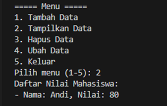
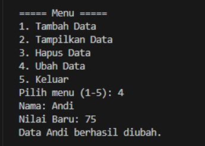

# Program sederhana dengan mengaplikasikan penggunaan class

### Contoh kode program sederhana Python3 (Vs Code)
   
   
   
   

**Penjelasan program:**

1.	**Class Mahasiswa**

     

     Kelas ini bertanggung jawab untuk mengelola data mahasiswa (CRUD: Create, Read, Update, Delete).

     * **Atribut:**

         * self.data: Sebuah dictionary yang digunakan untuk menyimpan data mahasiswa dengan format {nama: nilai}.

     * **Method:**

         1.	**__init__()**

             * Konstruktor untuk inisialisasi dictionary kosong pada atribut self.data.

         2. **tambah(nama, nilai)**

             

             * Menambahkan data mahasiswa baru ke dictionary.
             * Parameter:
                 - nama (str): Nama mahasiswa.
                 - nilai (int): Nilai mahasiswa.

         3. **tampilkan()**

             

             * Menampilkan seluruh data mahasiswa yang disimpan di dictionary.
             * Jika dictionary kosong, menampilkan pesan bahwa belum ada data.

         4. **hapus(nama)**

             

             * Menghapus data mahasiswa berdasarkan nama.
             * Parameter:
                 - nama (str): Nama mahasiswa yang ingin dihapus.

         5. **ubah(nama, nilai_baru)**

             

             * Mengubah nilai mahasiswa berdasarkan nama.
             * Parameter:
                 - nama (str): Nama mahasiswa yang ingin diubah.
                 - nilai_baru (int): Nilai baru untuk mahasiswa tersebut.

2.	**Class Menu**

     

     Kelas ini bertanggung jawab sebagai antarmuka pengguna dan mengatur alur program.

     * **Atribut:**

         * self.daftar: Objek dari class Mahasiswa yang digunakan untuk mengakses metode CRUD.

     * **Metode:**

         1.	**__init__()**

             * Konstruktor untuk membuat instance dari class Mahasiswa.

         2.	**tampilkan_menu()**

             

             * Menampilkan daftar menu pilihan ke layar.

         3.	**proses_input(menu)**

             

             * Mengeksekusi tindakan berdasarkan input pengguna.
             * Input:
                 - menu (str): Pilihan menu dari pengguna.
             * Logika:
                 - Menu 1: Meminta pengguna memasukkan nama dan nilai untuk ditambahkan ke daftar mahasiswa.
                 - Menu 2: Menampilkan data mahasiswa.
                 - Menu 3: Meminta pengguna memasukkan nama mahasiswa dan nilai baru untuk memperbarui data.
                 - Menu 4: Meminta pengguna memasukkan nama mahasiswa untuk dihapus.
                 - Menu 5: Mengakhiri program.
                 - Jika input tidak valid, menampilkan pesan kesalahan.

         4.	**jalankan()**

             

             * Melakukan loop tanpa henti untuk menampilkan menu, meminta input pengguna, dan memprosesnya.
             * Loop berhenti jika pengguna memilih opsi untuk keluar (Menu 5).

3.	**Alur Program**

     

     * Program dijalankan dengan membuat objek dari class Menu (app = Menu()).
     * Method jalankan() dipanggil, yang akan:
         - Menampilkan menu kepada pengguna.
         - Meminta pengguna memilih menu.
         - Mengeksekusi tindakan yang sesuai berdasarkan pilihan menu melalui proses_input(menu).
     * Pengguna dapat menambah, melihat, mengubah, atau menghapus data mahasiswa hingga memilih keluar (Menu 5).

### Contoh Input & Output penggunaan

1.	**Menambahkan Data**

     

     * Menu ini digunakan untuk menambahkan data mahasiswa.
     * Langkah-langkah:
         - Pilih menu dengan mengetik 1 lalu tekan Enter.
         - Masukkan Nama mahasiswa (contoh: Andi).
         - Masukkan Nilai Tugas (contoh: 80).
         - Data akan disimpan, dan pesan "Data (nama) berhasil ditambahkan." akan muncul.

2.	**Tampilkan Data**

     
     

     * Menu ini digunakan untuk melihat semua data mahasiswa.
     * Langkah-langkah:
         - Pilih menu dengan mengetik 2, lalu tekan Enter.
         - Urutan ditampilkan:
             - Jika ada data, urutan berisi daftar nilai mahasiswa.
             - Jika tidak ada data, akan ditampilkan dengan pesan "Belum ada data mahasiswa".

3.	**Hapus Data**

     
     

     * Menu ini digunakan untuk menghapus data mahasiswa berdasarkan nama.
     * Langkah-langkah:
         - Pilih menu dengan mengetik 3, lalu tekan Enter.
         - Masukkan nama mahasiswa yang ingin dihapus.
             - Jika data ditemukan, data akan dihapus, dan pesan "Data (nama) berhasil dihapus." akan muncul.
             - Jika data tidak ditemukan, pesan "Data (nama) tidak ditemukan." akan muncul.

4.	**Ubah Data**

     
     

     * Menu ini digunakan untuk mengubah data nilai mahasiswa yang sudah ada.
     * Langkah-langkah:
         - Pilih menu dengan mengetik 4, lalu tekan Enter.
         - Masukkan nama mahasiswa yang ingin diubah.
             - Jika data ditemukan, Anda akan diminta memasukkan data nilai baru.
             - Jika data tidak ditemukan, pesan "Data (nama)tidak ditemukan." akan muncul.
         - Setelah data diperbarui, pesan "Data (nama) berhasil diubah." akan muncul.

5.	**Keluar**

     

     * Menu ini digunakan untuk keluar dari program.
     * Langkah-langkah:
         - Pilih menu dengan mengetik 5, lalu tekan Enter.
         - Program akan menampilkan pesan "Program selesai." dan berhenti berjalan.

### Diagram Class

**Penjelasan:**

**Relasi Antar Class**

* **Aggregation:**
     * Class Menu memiliki atribut daftar, yang merupakan instance dari class Mahasiswa. Ini menandakan bahwa Menu bergantung pada Mahasiswa untuk menjalankan operasinya, tetapi keduanya adalah entitas yang terpisah.
     * Relasi ini bisa digambarkan sebagai "Menu HAS-A Mahasiswa".

**Penjelasan Detail**

1.	**Atribut**
     * data: Menyimpan data mahasiswa dalam dictionary di class Mahasiswa.
     * daftar: Menyimpan instance dari class Mahasiswa di class Menu.
2.	**Metode CRUD di Mahasiswa:**
     * tambah: Menambahkan data baru.
     * tampilkan: Menampilkan semua data yang tersimpan.
     * hapus: Menghapus data mahasiswa tertentu.
     * ubah: Mengubah data mahasiswa yang sudah ada.
3.	**Metode Pengelolaan Menu di Menu:**
     * tampilkan_menu: Memunculkan daftar opsi menu.
     * proses_input: Menerjemahkan input pengguna dan memanggil metode terkait di class Mahasiswa.
     * jalankan: Melakukan loop utama untuk menjalankan program.

### Flowchart 

 
**Penjelasan flowchart:**

* **Mulai**
* **Tampilkan Menu**
     * Menu utama ditampilkan kepada pengguna, berisi pilihan:
         1.	Tambah Data
         2.	Tampilkan Data
         3.	Ubah Data
         4.	Hapus Data
         5.	Keluar
* **Pilih Menu**
     * Pengguna diminta memilih angka menu (1-5).
* **Menu Pilihan**
     * **Pilihan 1 - Tambah Data:**
         - Masukkan nama mahasiswa dan nilai.
         - Data mahasiswa ditambahkan ke dalam dictionary.
     * **Pilihan 2 - Tampilkan Data:**
         - Menampilkan semua data mahasiswa yang ada di dalam dictionary.
         - Jika data kosong, tampilkan pesan bahwa data belum ada.
     * **Pilihan 3 - Ubah Data:**
         - Meminta nama mahasiswa yang ingin diubah nilainya.
         - Jika mahasiswa ada, nilai mahasiswa diperbarui.
         - Jika tidak ditemukan, tampilkan pesan kesalahan.
     * **Pilihan 4 - Hapus Data:**
         - Meminta nama mahasiswa yang ingin dihapus.
         - Jika mahasiswa ada, data dihapus.
         - Jika tidak ditemukan, tampilkan pesan kesalahan.
     * **Pilihan 5 - Keluar:**
         - Program berhenti dan keluar.
* **Validasi Menu**
     * Jika pilihan yang dimasukkan tidak valid (misalnya angka selain 1-5), tampilkan pesan kesalahan dan kembali ke menu.
* **Ulangi Proses**
     * Setelah menyelesaikan setiap aksi (menambah, menampilkan, mengubah, atau menghapus data), menu ditampilkan kembali dan program meminta input menu selanjutnya.
* **Selesai**
     * Program berakhir ketika pengguna memilih opsi "Keluar".
