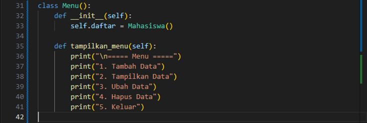
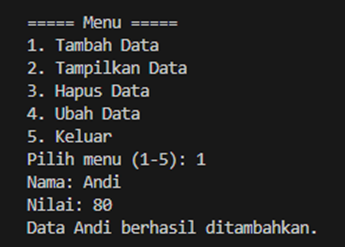
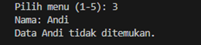
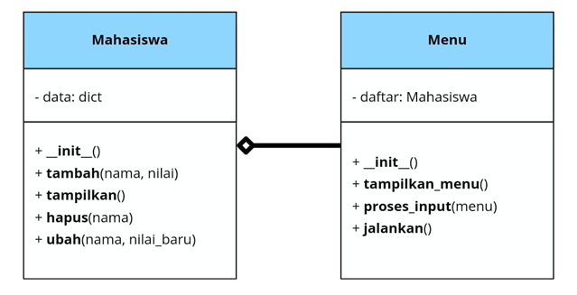
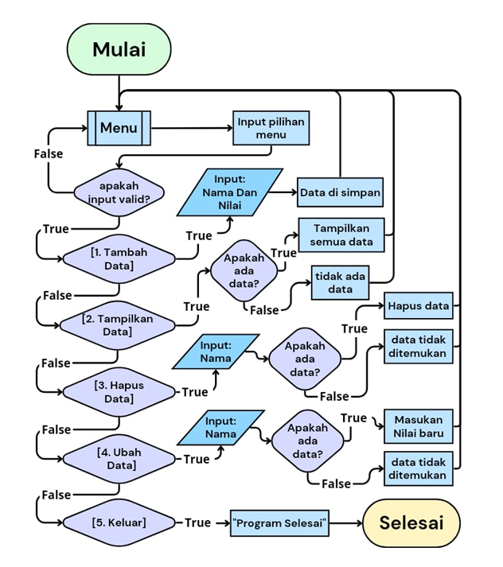

# Program sederhana dengan mengaplikasikan penggunaan class

### Contoh kode program sederhana Python3 (Vs Code)
   
   
   

**Penjelasan program:**
1.	**Class Mahasiswa**
     
     * Fungsi utama: Mengelola data mahasiswa menggunakan dictionary.
         - Key: Nama mahasiswa.
         - Value: Nilai mahasiswa.
     * Method:
         - tambah(nama, nilai): Menambahkan mahasiswa baru ke dalam dictionary.
             
         - tampilkan(): Menampilkan seluruh data mahasiswa yang tersimpan.
             
         - hapus(nama): Menghapus data mahasiswa berdasarkan nama.
             
         - ubah(nama, nilai_baru): Mengubah nilai mahasiswa berdasarkan nama.
             
2.	**Antarmuka Menu**
     
     * Program berjalan dalam loop, menampilkan menu pilihan berikut:
         - Tambah Data (1)
         - Tampilkan Data (2)
         - Ubah Data (3)
         - Hapus Data (4)
         - Keluar (5).
     * Input dari pengguna menentukan fungsi mana yang akan dijalankan.
     * Setelah selesai dengan suatu operasi, menu akan ditampilkan kembali hingga pengguna memilih opsi keluar.

**Contoh Input & Output penggunaan**
1.	**Menambahkan Data**
     
     * Menu ini digunakan untuk menambahkan data mahasiswa.
     * Langkah-langkah:
         - Pilih menu dengan mengetik 1 lalu tekan Enter.
         - Masukkan Nama mahasiswa (contoh: Andi).
         - Masukkan Nilai Tugas (contoh: 80).
         - Data akan disimpan, dan pesan "Data berhasil ditambahkan." akan muncul.
2.	**Tampilakan Data**
     
     
     * Menu ini digunakan untuk melihat semua data mahasiswa.
     * Langkah-langkah:
         - Pilih menu dengan mengetik 2, lalu tekan Enter.
         - Urutan ditampilkan:
             - Jika ada data, urutan berisi daftar nilai mahasiswa.
             - Jika tidak ada data, akan ditampilkan dengan pesan "Belum ada data mahasiswa".
3.	**Ubah Data**
     
     
     * Menu ini digunakan untuk mengubah data nilai mahasiswa yang sudah ada.
     * Langkah-langkah:
         - Pilih menu dengan mengetik 3, lalu tekan Enter.
         - Masukkan nama mahasiswa yang ingin diubah.
             - Jika data ditemukan, Anda akan diminta memasukkan data nilai baru.
             - Jika data tidak ditemukan, pesan "Data (nama)tidak ditemukan." akan muncul.
         - Setelah data diperbarui, pesan "Data (nama) berhasil diubah." akan muncul.
4.	**Hapus Data**
     
     
     * Menu ini digunakan untuk menghapus data mahasiswa berdasarkan nama.
     * Langkah-langkah:
         - Pilih menu dengan mengetik 4, lalu tekan Enter.
         - Masukkan nama mahasiswa yang ingin dihapus.
             - Jika data ditemukan, data akan dihapus, dan pesan "Data (nama) berhasil dihapus." akan muncul.
             - Jika data tidak ditemukan, pesan "Data (nama) tidak ditemukan." akan muncul.
5.	**Keluar**
     
     * Menu ini digunakan untuk keluar dari program.
     * Langkah-langkah:
         - Pilih menu dengan mengetik 5, lalu tekan Enter.
         - Program akan menampilkan pesan "Program selesai." dan berhenti berjalan.

### Diagram Class

**Penjelasan:**

**Nama Class: Mahasiswa**
* Class Mahasiswa adalah entitas yang bertanggung jawab untuk mengelola data mahasiswa, seperti menambah, mengubah, menampilkan, dan menghapus data mahasiswa.
**Atribut (Attributes)**
* data: dict
     - Atribut ini menyimpan data mahasiswa dalam bentuk pasangan kunci-nilai.
         - Kunci (Key): Nama mahasiswa.
         - Nilai (Value): Nilai mahasiswa yang terhubung dengan nama tersebut.
**Metode (Methods)**
1.	**__init__():**
     * Merupakan constructor atau metode yang dipanggil ketika objek Mahasiswa pertama kali dibuat.
     * Pada metode ini, atribut data diinisialisasi sebagai dictionary kosong ({}).
2.	**tambah(nama, nilai):**
     * Metode ini digunakan untuk menambahkan data mahasiswa baru ke dalam dictionary data.
3.	**tampilkan():**
     * Metode ini digunakan untuk menampilkan semua data mahasiswa yang ada dalam dictionary data.
     * Jika data kosong, maka akan menampilkan pesan bahwa belum ada data mahasiswa.
4.	**hapus(nama):**
     * Metode ini digunakan untuk menghapus data mahasiswa berdasarkan nama.
     * Jika mahasiswa dengan nama yang diberikan ada dalam dictionary, maka data tersebut akan dihapus.
5.	**ubah(nama, nilai_baru):**
     * Metode ini digunakan untuk mengubah nilai mahasiswa berdasarkan nama.
     * Jika nama mahasiswa ditemukan dalam dictionary, maka nilai mahasiswa tersebut akan diperbarui dengan nilai_baru.

### Flowchart 

 
**Penjelasan flowchart:**

* **Mulai**
* **Tampilkan Menu**
     * Menu utama ditampilkan kepada pengguna, berisi pilihan:
         1.	Tambah Data
         2.	Tampilkan Data
         3.	Ubah Data
         4.	Hapus Data
         5.	Keluar
* **Pilih Menu**
     * Pengguna diminta memilih angka menu (1-5).
* **Menu Pilihan**
     * **Pilihan 1 - Tambah Data:**
         - Masukkan nama mahasiswa dan nilai.
         - Data mahasiswa ditambahkan ke dalam dictionary.
     * **Pilihan 2 - Tampilkan Data:**
         - Menampilkan semua data mahasiswa yang ada di dalam dictionary.
         - Jika data kosong, tampilkan pesan bahwa data belum ada.
     * **Pilihan 3 - Ubah Data:**
         - Meminta nama mahasiswa yang ingin diubah nilainya.
         - Jika mahasiswa ada, nilai mahasiswa diperbarui.
         - Jika tidak ditemukan, tampilkan pesan kesalahan.
     * **Pilihan 4 - Hapus Data:**
         - Meminta nama mahasiswa yang ingin dihapus.
         - Jika mahasiswa ada, data dihapus.
         - Jika tidak ditemukan, tampilkan pesan kesalahan.
     * **Pilihan 5 - Keluar:**
         - Program berhenti dan keluar.
* **Validasi Menu**
     * Jika pilihan yang dimasukkan tidak valid (misalnya angka selain 1-5), tampilkan pesan kesalahan dan kembali ke menu.
* **Ulangi Proses**
     * Setelah menyelesaikan setiap aksi (menambah, menampilkan, mengubah, atau menghapus data), menu ditampilkan kembali dan program meminta input menu selanjutnya.
* **Selesai**
     * Program berakhir ketika pengguna memilih opsi "Keluar".
